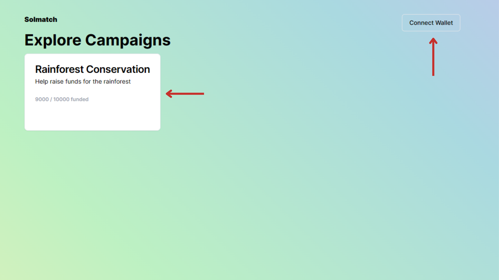
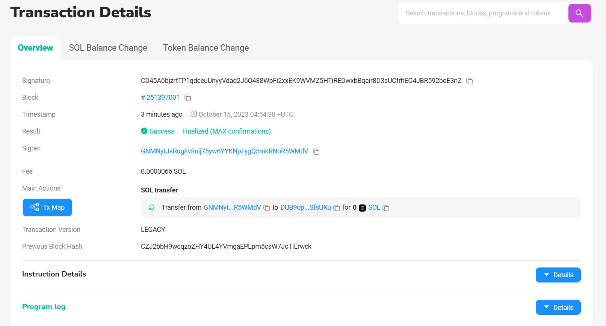

# SolMatch

Solmatch, a donation platform that utilizes blockchain technology for transparent transactions

For a better understanding of the project, do check out our pitch deck [here](https://www.canva.com/design/DAFxTcSyYbs/yFRElmTAPKkTgo583cFsEg/view?utm_content=DAFxTcSyYbs&utm_campaign=designshare) and the demo of our application [here](https://www.youtube.com/watch?v=Is8OEULcUW0)!

# Table of Contents
- [Problem and Solution](#problem-and-solution)
- [Process Flow](#process-flow)
- [Technical Stack](#technical-stack)
- [Walkthrough](#walkthrough)
- [Setup and Installation](#setup-and-installation)
- [Useful Resources](#useful-resources)
- [BUILDERS](#builders)

## Problem and Solution
When we give to charities, we rarely have the ability to check how our donations are being used. These can lead to the misuse of funds for vanity projects and predatory pickpocketing by middlemen. Ultimately the individuals who are harmed the most are the beneficiaries who are shortchanged. 

With blockchain technology, we can enable donors to review the track records of charities to build credibility and trust in their donations. Our solution is Solmatch, a donation platform powered by Solana.

SolMatch has three key features: 
<ul>
    <li>Transparent Donations on Chain</li>
    <li>Holding funds in escrow</li>
    <li>Commitment fulfillment to whitelisted suppliers</li>
</ul>

## Process Flow

1. Charity reaches out to the Team at SolMatch
2. We create a donation contract for the Charity's campaign on Solana and list it on our website
3. Donors can fund the campaign with SOL
4. Once the campaign has been funded, the charity can start executing the commitments that are stipulated in the contract by sending funds to the whitelisted addresses of suppliers
5. Donors can review transactions of the specific charities and the associated campaigns on-chain

## Technical Stack

<ul>
    <li>The front end of our application was built using Next.js</li>
    <li>Backend infrastructure consists of our interactions on the Solana Blockchain as well as our Firebase Application for linking the campaign IDs to the front end</li>
</ul>

## Walkthrough

<ul>
    <li>A donor can connect their wallet to the front end</li>
    <li>After conecting the wallet the user can select a specific campaign listed</li>
</ul>

<ul>
    <li>The donor can view the commitments specific by the campaign in terms of percentage of funds allocated to a specific supplier</li>
    <li>The donor can also view recent donations from other users</li>
    <li>The donor can choose to donate and send SOL to the campaign</li>
</ul>

<ul>
    <li>After the donation has been completed the donor can view the transaction on-chain</li>
</ul>

## Setup and Installation

1. git clone
2. cd Codebase
3. npm install -i
4. npm run dev

<i>The application interacts with the solana devnet so make sure you have enough devnet SOL!</i>

## Useful Resources

1. [Phantom Developer Documentation](https://docs.phantom.app/introduction/readme)
2. [Solana Web3 JS Documentation](https://docs.solana.com/developing/clients/javascript-api)
3. [Solana Faucet](https://solfaucet.com/)

## Builders
Do feel free to connect with us!
- Liam Ayathan [[LinkedIn]](https://www.linkedin.com/in/liam-ayathan-046b3816b/) , [[Github]](https://github.com/liam-ayathan)
- Maaruni Pandithurai [[LinkedIn]](https://www.linkedin.com/in/maaruni/), [[Github]](https://github.com/maars202)
- George Loh [[LinkedIn]](https://www.linkedin.com/in/ying-zhe-george-loh-17756a95/) , [[Github]](https://github.com/YZLoh)
